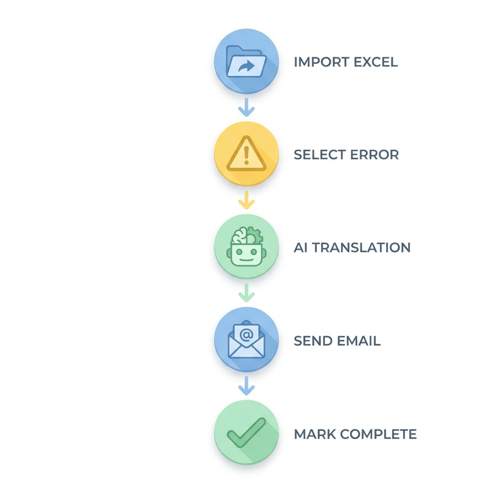

# 📖 HƯỚNG DẪN SỬ DỤNG KDTPS MANAGER

Chào mừng bạn! Đây là trợ lý giúp bạn xử lý các file lỗi KDTPS một cách nhanh chóng và nhàn hạ nhất.

---

## 🎨 Sơ Đồ Quy Trình (Flowchart)

---

## 🚀 5 Bước Xử Lý Lỗi "Thần Tốc"

1. **Nạp dữ liệu (Import):**
   - Trên thanh công cụ trên cùng, chọn nút **📂 Nạp file KDTPS**.
   - Chọn file Excel tổng hợp từ Server. Phần mềm sẽ tự giải mã mật khẩu và lấy dữ liệu mới cho bạn.

2. **Chọn lỗi cần xử lý:**
   - Nhìn vào bảng chính, các dòng màu **Vàng** là lỗi đang chờ bạn điều tra.
   - Bấm chuột vào dòng lỗi đó để xem chi tiết ở bảng bên dưới.

3. **Dịch nội dung (Nếu cần):**
   - Nếu nội dung là tiếng Nhật, đừng lo! Hãy bôi đen đoạn chữ đó, bấm chuột phải và chọn **Dịch sang tiếng Việt**.
   - Trợ lý AI (Gemini) sẽ dịch cho bạn cực kỳ dễ hiểu.

4. **Gửi Mail báo cáo:**
   - Sau khi có kết quả điều tra, bấm nút **✉️ Gửi thư (Reply)**.
   - Phần mềm tự động soạn sẵn một bức thư tiếng Nhật chuẩn chỉnh, bạn chỉ việc nhấn "Gửi" trong Outlook.

5. **Hoạt tất & Lưu trữ:**
   - Khi xong việc, tích vào ô **✅ Hoàn thành**. Dòng lỗi sẽ chuyển sang màu **Xanh**.
   - Cuối tuần, bạn có thể dùng nút **� Sao lưu (Backup)** để dọn dẹp bảng cho sạch sẽ.

---

## 💡 Các Mẹo Nhỏ Để Làm Việc Nhàn Hơn

- **Tự động đồng bộ:** Bạn vào **Cài đặt -> Đồng bộ** và bật nó lên. App sẽ tự canh gác server, có lỗ mới là nó báo ngay, bạn không cần phải tự đi tìm file nữa.
- **Xem biểu đồ:** Vào tab **📈 Dashboard Pro** để xem hôm nay mình đã xử lý được bao nhiêu lỗi, còn tồn đọng bao nhiêu cái qua các biểu đồ màu sắc.
- **Tìm kiếm:** Nếu muốn tìm lại lỗi cũ từ năm ngoái, hãy vào tab **🔍 Tìm kiếm**, gõ mã máy hoặc mã lỗi là thấy ngay.

---

## ❓ Câu Hỏi Thường Gặp

- **Hỏi:** Sao biểu đồ không hiện gì?
- **Đáp:** Bạn hãy nhấn nút **Làm mới (Refresh)** hoặc chọn đúng Phòng ban của mình ở thanh phía trên nhé.

- **Hỏi:** Phần mềm có làm hỏng file Excel gốc trên Server không?
- **Đáp:** KHÔNG. Phần mềm chỉ đọc dữ liệu và lưu vào máy bạn, cực kỳ an toàn cho dữ liệu chung.

---
*Chúc bạn làm việc hiệu quả và sớm được về sớm!* 😊
